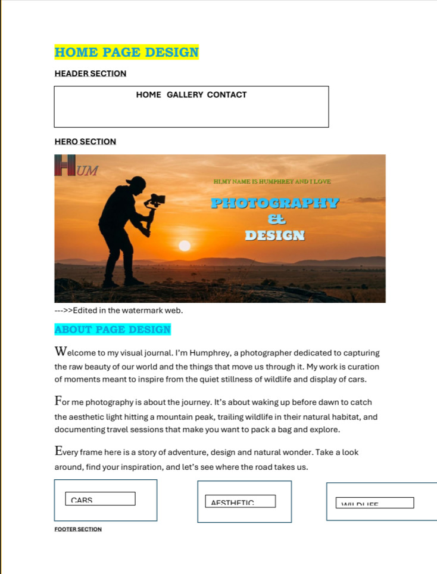

# HUMPHREY PHOTOGRAPHY && DESIGN

## Author
* **Name:** Humphrey Otieno
* **Role:** Front-End Developer

## Description of Project
This is a portfolio website designed to showcase a photographer dedicated to capturing the raw beauty of our world. Inspiring and appreciating the aesthetic beauty of landscape, different cars' diplays and documenting travels.
**Build completely from scratch using HTML and CSS only**.

### Project Setup Instructions
* **Link to GitHub**
https://github.com/humphrey-developer/photography-website.git

* **Link to Live-Website**
https://humphrey-developer.github.io/photography-website/

#### How I designed using Ms.Word,

#### Copyright and Licence Information
&Copyright 2026 Humphrey photography.All rights reserved.
This project is free and available under the **MIT Licence**

